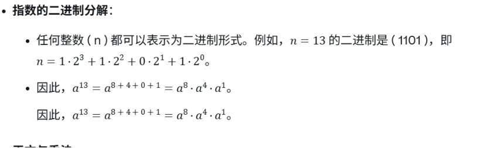

## 费马小定理&&模幂算法

用通俗的话来说：
如果 ( p ) 是一个质数，选一个数 ( a )，只要 ( a ) 不是 ( p ) 的倍数，那么 ( a ) 的p−1次方除以 ( p )，余数一定是 1。
```java
public static boolean isPrime(int n) {
    // Corner cases
    if (n <= 1 || n == 4) return false;
    if (n <= 3) return true;

    int k = 3; // Try k = 3 times
    while (k > 0)
    {
        // Pick a random number in [2..n-2]
        // Above corner cases make sure that n > 4
        int a = 2 + (int)(Math.random() % (n - 4));
        // Fermat's little theorem
        if (power(a, n - 1, n) != 1)
            return false;
        k--;
    }

    return true;
}
```
  

```java
/**

* This is a helper method to isPrime. You can ignore this method.
* It is an iterative Function to calculate a^n mod p in log time
* 
* @source: https://www.geeksforgeeks.org/primality-test-set-2-fermet-method/
  */
  static int power(int a, int n, int p)
  {
    // Initialize result
    int res = 1;

    // Update 'a' if 'a' >= p
    a = a % p;

    while (n > 0)
    {
        // If n is odd, multiply 'a' with result
        if ((n & 1) == 1)
        res = (res * a) % p;

        // n must be even now
        n = n >> 1; // n = n/2
        a = (a * a) % p;
    }
    return res;
  }
```
